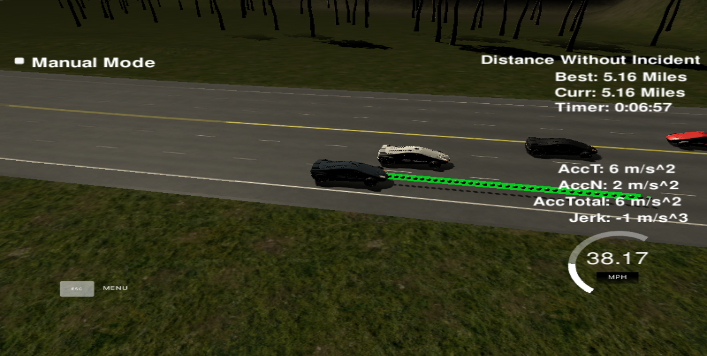

# CarND-Path-Planning-Project

## Overview
In this project, we will implement the path planning project for Udacity. We will test the project on Udacity's simulator which can be found [here.](https://github.com/udacity/self-driving-car-sim/releases/tag/T3_v1.2) The simulator will transmit telemetry data and the sensor fusion data from the highway scenario in the simulator. The communication between the simulator and the path planner is done using WebSocket. The path planner uses the uWebSockets WebSocket implementation to handle this communication. Udacity provides a seed project to start from on this project [here.](https://github.com/udacity/CarND-Path-Planning-Project)


### Simulator.
   
You can download the Term3 Simulator which contains the Path Planning Project from the [releases tab (https://github.com/udacity/self-driving-car-sim/releases/tag/T3_v1.2).  

To run the simulator on Mac/Linux, first make the binary file executable with the following command:
```shell
sudo chmod u+x {simulator_file_name}
```

### Goals
In this project your goal is to safely navigate around a virtual highway with other traffic that is driving +-10 MPH of the 50 MPH speed limit. You will be provided the car's localization and sensor fusion data, there is also a sparse map list of waypoints around the highway. The car should try to go as close as possible to the 50 MPH speed limit, which means passing slower traffic when possible, note that other cars will try to change lanes too. The car should avoid hitting other cars at all cost as well as driving inside of the marked road lanes at all times, unless going from one lane to another. The car should be able to make one complete loop around the 6946m highway. Since the car is trying to go 50 MPH, it should take a little over 5 minutes to complete 1 loop. Also the car should not experience total acceleration over 10 m/s^2 and jerk that is greater than 10 m/s^3.

#### The map of the highway is in data/highway_map.txt
Each waypoint in the list contains  [x,y,s,dx,dy] values. x and y are the waypoint's map coordinate position, the s value is the distance along the road to get to that waypoint in meters, the dx and dy values define the unit normal vector pointing outward of the highway loop.

The highway's waypoints loop around so the frenet s value, distance along the road, goes from 0 to 6945.554.

## Basic Build Instructions

1. Clone this repo.
2. Make a build directory: `mkdir build && cd build`
3. Compile: `cmake .. && make`
4. Run it: `./path_planning`.

Here is the data provided from the Simulator to the C++ Program

#### Main car's localization Data (No Noise)

["x"] The car's x position in map coordinates

["y"] The car's y position in map coordinates

["s"] The car's s position in frenet coordinates

["d"] The car's d position in frenet coordinates

["yaw"] The car's yaw angle in the map

["speed"] The car's speed in MPH

#### Previous path data given to the Planner

//Note: Return the previous list but with processed points removed, can be a nice tool to show how far along
the path has processed since last time. 

["previous_path_x"] The previous list of x points previously given to the simulator

["previous_path_y"] The previous list of y points previously given to the simulator

#### Previous path's end s and d values 

["end_path_s"] The previous list's last point's frenet s value

["end_path_d"] The previous list's last point's frenet d value

#### Sensor Fusion Data, a list of all other car's attributes on the same side of the road. (No Noise)

["sensor_fusion"] A 2d vector of cars and then that car's [car's unique ID, car's x position in map coordinates, car's y position in map coordinates, car's x velocity in m/s, car's y velocity in m/s, car's s position in frenet coordinates, car's d position in frenet coordinates. 

## Details

1. The car uses a perfect controller and will visit every (x,y) point it recieves in the list every .02 seconds. The units for the (x,y) points are in meters and the spacing of the points determines the speed of the car. The vector going from a point to the next point in the list dictates the angle of the car. Acceleration both in the tangential and normal directions is measured along with the jerk, the rate of change of total Acceleration. The (x,y) point paths that the planner recieves should not have a total acceleration that goes over 10 m/s^2, also the jerk should not go over 50 m/s^3. (NOTE: As this is BETA, these requirements might change. Also currently jerk is over a .02 second interval, it would probably be better to average total acceleration over 1 second and measure jerk from that.

2. There will be some latency between the simulator running and the path planner returning a path, with optimized code usually its not very long maybe just 1-3 time steps. During this delay the simulator will continue using points that it was last given, because of this its a good idea to store the last points you have used so you can have a smooth transition. previous_path_x, and previous_path_y can be helpful for this transition since they show the last points given to the simulator controller with the processed points already removed. You would either return a path that extends this previous path or make sure to create a new path that has a smooth transition with this last path.


## Dependencies

* cmake >= 3.5
  * All OSes: [click here for installation instructions](https://cmake.org/install/)
* make >= 4.1
  * Linux: make is installed by default on most Linux distros
  * Mac: [install Xcode command line tools to get make](https://developer.apple.com/xcode/features/)
  * Windows: [Click here for installation instructions](http://gnuwin32.sourceforge.net/packages/make.htm)
* gcc/g++ >= 5.4
  * Linux: gcc / g++ is installed by default on most Linux distros
  * Mac: same deal as make - [install Xcode command line tools]((https://developer.apple.com/xcode/features/)
  * Windows: recommend using [MinGW](http://www.mingw.org/)
* [uWebSockets](https://github.com/uWebSockets/uWebSockets)
  * Run either `install-mac.sh` or `install-ubuntu.sh`.
  * If you install from source, checkout to commit `e94b6e1`, i.e.
    ```
    git clone https://github.com/uWebSockets/uWebSockets 
    cd uWebSockets
    git checkout e94b6e1
    ```

## Implementation

I started with the provided code from the seed project. I added the path-planning algorithm implementation in the src/main.cpp file. The path planning algorithm implementation into various segments, the first segment uses the sensor fusion inputs to process the telemetry data and the sensor fusion data. This part of the code is located from line 102 - line 153 in the src/main.cpp finds clues about the surrounding environment of the Host, like in here we find the current lane of the host vehicle and also the lane occupancy status of the neighbouring lanes to the host vehicles. I set a threshold of 30m ahead or behind the host vehicle. This part finds if there is a car ahead blocking us, is there a car in the right or the left lane which makes lane change unsafe if it is less than 30m.

The behaviour part of the code in the main.cpp from line 155 - line 186 tries to decide the intended behaviour of the host vehicle, for example should we change lanes when there is a car ahead or do we accelerate or deccelerate. Bases on the initial situation we are in, this part of the code accelerates or deccelerates or initiates the lane change if it is deemed to be safe. Instead of increasing the speed at this part of the code, a speed_diff is created to be used for speed changes when generating the trajectory in the last part of the code. This approach makes the car more responsive acting faster to changing situations like a car in front of it trying to apply breaks to cause a collision.

The trajectory part of the code does the calculation of the trajectory based on the speed and lane output from the behavior, car coordinates and past path points. This part of the code is in main.cpp from line 188 - line 298, the previous trajectory's last two points are used with three points at a distance to use it for initializing the spline calculation. The rest of the points in the trajectory are calculated by evaluating the spline and transforming the outupt coordinates. The speed change is decided on the behavior part of the code, but it is used in that part to increase/decrease speed on every trajectory points instead of doing it for the complete trajectory.


## Results

The code compiles without any issues and to run the simulator execute the simulator from the terminal and select the start button and the car should start driving on the highway. Refer to pictures below for reference.


The picture above is the simulator startup page and the picture below shows the rubric criteria of driving without incident being met.



Rubric Criteria met-
1. The car is able to drive at least 4.32 miles without incident.
2. The car drives according to the speed limit.
3. Max Acceleration and Jerk are not Exceeded.
4. Car does not have collisions.
5. The car stays in its lane, except for the time between changing lanes.
6. The car is able to change lanes

